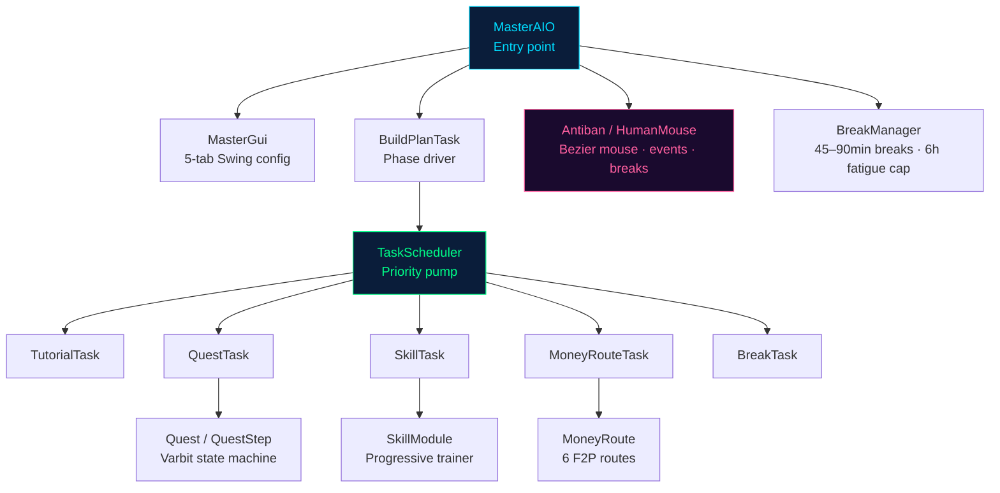
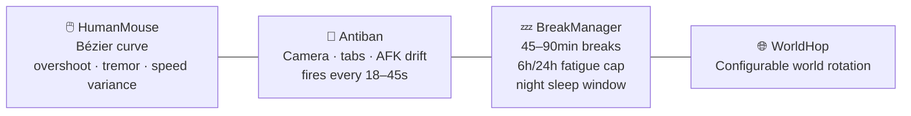

<div align="center">


# CyberBot — FLLC Master AIO

**Fully automated F2P account builder — zero to max, hands-free, 24/7**

[](https://openjdk.org/)
[](https://dreambot.org/)
[](../LICENSE)
[](#-quests)
[](#-skills)
[](#-money-routes)
[](#-build-plan)

*Takes a brand-new account from the login screen through Tutorial Island, all 23 F2P quests, and a complete route-to-99 on every F2P skill. One script. No keyboard.*

</div>

---

## ⚠️ Disclaimer

Running bot scripts violates Jagex's Terms of Service. Every account that runs this code is at risk of a permanent ban. Use **disposable accounts only**.

---

## 🏗️ Architecture




| Layer | Class | Responsibility |
|---|---|---|
| 🚀 Entry | [`MasterAIO`](src/nezz/dreambot/master/core/MasterAIO.java) | `@ScriptManifest`, lifecycle, cyberpunk HUD paint |
| 🧠 State | [`BotState`](src/nezz/dreambot/master/core/BotState.java) | top-level lifecycle enum (TUTORIAL / QUESTING / SKILLING / MONEY_MAKING / BANKING …) |
| ⚙️ Config | [`Profile`](src/nezz/dreambot/master/profile/Profile.java) | account creds, build plan, antiban settings, mule, stop conditions |
| 📋 Plan | [`BuildPlan`](src/nezz/dreambot/master/profile/BuildPlan.java) | ordered `Phase` list · `defaultF2P()` factory (17 macro-phases, 60+ steps) |
| 🔄 Scheduler | [`TaskScheduler`](src/nezz/dreambot/master/tasks/TaskScheduler.java) | priority-ordered task pump, one ready task per tick |
| 🗺️ Driver | [`BuildPlanTask`](src/nezz/dreambot/master/tasks/BuildPlanTask.java) | walks plan → materializes + registers subtasks |
| ⚔️ Quests | [`Quest`](src/nezz/dreambot/master/quests/Quest.java) / [`QuestTask`](src/nezz/dreambot/master/quests/QuestTask.java) | varbit/varp driven step machine — 23 quests |
| 💪 Skills | [`SkillModule`](src/nezz/dreambot/master/skills/SkillModule.java) / [`SkillTask`](src/nezz/dreambot/master/skills/SkillTask.java) | progressive multi-method trainers |
| 💰 Money | [`MoneyRoute`](src/nezz/dreambot/master/money/MoneyRoute.java) / [`MoneyRouteTask`](src/nezz/dreambot/master/money/MoneyRouteTask.java) | GP-target phases with time-based estimation |
| 🛡️ Antiban | [`HumanMouse`](src/nezz/dreambot/master/antiban/HumanMouse.java) / [`Antiban`](src/nezz/dreambot/master/antiban/Antiban.java) / [`BreakManager`](src/nezz/dreambot/master/antiban/BreakManager.java) | Bézier mouse, random events, break scheduling |
| 🖥️ GUI | [`MasterGui`](src/nezz/dreambot/master/gui/MasterGui.java) | 5-tab cyberpunk Swing config window |
| 🆔 IDs | [`id/*`](src/nezz/dreambot/master/id/) | RuneLite + Quest-Helper varbit/varp/item/npc/object ports |

---

## 📅 Build Plan


The default plan (`BuildPlan.defaultF2P()`) has **17 macro-phases** and **60+ individual steps**:


Phases are colour-coded: 🟢 tutorial &nbsp;|&nbsp; 🔵 quests &nbsp;|&nbsp; ⚪ skills &nbsp;|&nbsp; 🟡 money &nbsp;|&nbsp; 🔴 endgame

---

## 📜 Quests

All **23 F2P quests** are implemented and automatically dispatched from the build plan.

| # | Quest | QP | Varbit / Varp | Phase |
|---|---|:---:|---|:---:|
| 1 | 🍳 Cook's Assistant | 1 | varbit 29 | 1 |
| 2 | 🐑 Sheep Shearer | 1 | varbit 179 | 1 |
| 3 | ✖️ X Marks the Spot | 1 | varbit 3261 | 1 |
| 4 | 🔮 Rune Mysteries | 1 | varp 63 | 1 |
| 5 | 💀 Restless Ghost | 1 | varp 107 | 1 |
| 6 | 🧙 Witch's Potion | 1 | varp 67 | 1 |
| 7 | 🥛 Ides of Milk | 1 | varbit 13065 | 1 |
| 8 | 🏔️ Below Ice Mountain | 1 | varbit 11103 | 1 |
| 9 | 🐔 Ernest the Chicken | 4 | varp 32 | 4 |
| 10 | 👺 Goblin Diplomacy | 5 | varp 130 | 4 |
| 11 | ❤️ Romeo and Juliet | 5 | varp 144 | 4 |
| 12 | 🦋 Imp Catcher | 1 | varp 160 | 4 |
| 13 | ⛏️ Doric's Quest | 1 | varp 31 | 4 |
| 14 | 🗝️ Misthalin Mystery | 1 | varbit 6557 | 4 |
| 15 | 💎 Pirate's Treasure | 2 | varp 263 | 6 |
| 16 | 🤴 Prince Ali Rescue | 3 | varp 273 | 6 |
| 17 | 🧛 Vampyre Slayer | 3 | varp 178 | 6 |
| 18 | ⚓ The Corsair Curse | 2 | varbit 5941 | 6 |
| 19 | ♟️ Black Knights' Fortress | 3 | varp 273 | 9 |
| 20 | 🔥 Demon Slayer | 3 | varbit 3532 | 9 |
| 21 | 🛡️ Shield of Arrav | 1 | varp 146 | 9 |
| 22 | ⚔️ The Knight's Sword | 1 | varp 122 | 9 |
| 23 | 🐉 Dragon Slayer I | 2 | varp 176 | 10 |

**Total: 43 Quest Points** — unlocks Dragon Slayer I (requires 32 QP) with 11 QP to spare.

---

## 💪 Skills

### Fully implemented (real multi-method logic)

| Skill | Methods / Progression | Module |
|---|---|---|
| ⚔️ Attack | chickens → cows → rock crabs → ogresses | [`AttackModule`](src/nezz/dreambot/master/skills/impl/AttackModule.java) |
| 💪 Strength | same progression, AGGRESSIVE style | [`StrengthModule`](src/nezz/dreambot/master/skills/impl/StrengthModule.java) |
| 🛡️ Defense | same progression, DEFENSIVE style | [`DefenseModule`](src/nezz/dreambot/master/skills/impl/DefenseModule.java) |
| 🏹 Ranged | cows → minotaurs → crabs | [`RangedModule`](src/nezz/dreambot/master/skills/impl/RangedModule.java) |
| 🪄 Magic | wind strike → splash → high alch | [`MagicModule`](src/nezz/dreambot/master/skills/impl/MagicModule.java) |
| 🙏 Prayer | bury → gilded altar → chaos altar | [`PrayerModule`](src/nezz/dreambot/master/skills/impl/PrayerModule.java) |
| ⛏️ Mining | tin → iron → coal → MLM | [`MiningModule`](src/nezz/dreambot/master/skills/impl/MiningModule.java) |
| 🪓 Woodcutting | tree → oak → willow → maple → yew → magic | [`WoodcuttingModule`](src/nezz/dreambot/master/skills/impl/WoodcuttingModule.java) |
| 🎣 Fishing | shrimp → trout → lobster → swordfish → shark | [`FishingModule`](src/nezz/dreambot/master/skills/impl/FishingModule.java) |
| 🍳 Cooking | range 1→99 progressive | [`CookingModule`](src/nezz/dreambot/master/skills/impl/CookingModule.java) |
| 🔥 Firemaking | logs → oak → willow → maple → yew | [`FiremakingModule`](src/nezz/dreambot/master/skills/impl/FiremakingModule.java) |
| 🧵 Crafting | leather → gold jewellery | [`CraftingModule`](src/nezz/dreambot/master/skills/impl/CraftingModule.java) |
| 🏹 Fletching | logs → arrow shafts → shortbows | [`FletchingModule`](src/nezz/dreambot/master/skills/impl/FletchingModule.java) |
| 🌀 Runecrafting | air altar → body altar → fire altar | [`RunecraftingModule`](src/nezz/dreambot/master/skills/impl/RunecraftingModule.java) |
| 🔨 Smithing | bronze → iron → steel → mithril → adamant | [`SmithingModule`](src/nezz/dreambot/master/skills/impl/SmithingModule.java) |
| 🥷 Thieving | men → women → HAM members → knights | [`ThievingModule`](src/nezz/dreambot/master/skills/impl/ThievingModule.java) |
| 💀 Brutus (combat grind) | chickens → cows → hill giants → flesh crawlers | [`BrutusKillerModule`](src/nezz/dreambot/master/skills/impl/BrutusKillerModule.java) |

### Stub / pending (addressable from plan, noop tick body)

`Agility` · `Herblore` · `Hunter` · `Slayer` · `Farming` · `Construction` · `Sailing`

These are registered in [`SkillRegistry`](src/nezz/dreambot/master/skills/SkillRegistry.java) via [`ScaffoldedSkills`](src/nezz/dreambot/master/skills/impl/ScaffoldedSkills.java). They will not block the F2P build plan since none are required phases.

---

## 💰 Money Routes

GP phases automatically select and run a `MoneyRoute` until the GP target is reached. Progress is estimated from elapsed time × route GP/hr and shown on the HUD.

| Route ID | Method | Est. GP/hr | Min. Req. | Used in Plan |
|---|---|:---:|---|:---:|
| `chicken` | Kill chickens · bank feathers | ~7k | none | Phase 3 |
| `cowhide` | Kill cows · bank hides → GE | ~24k | Attack 1 | Phases 3, 7, 11 |
| `flax_spin` | Pick flax → spin → GE | ~112k | none | Phases 7, 11 |
| `steel_bars` | Smelt steel bars → GE | ~20k | Mining 30, Smithing 30 | Phase 14 |
| `air_runes` | Craft air runes at altar | ~8k | Runecrafting 1 | — |
| `yew_logs` | Cut yew logs → GE | ~28k | Woodcutting 60 | — |

Routes are registered in [`MoneyRouteRegistry`](src/nezz/dreambot/master/money/MoneyRouteRegistry.java). ID lookup is case-insensitive.

---

## 🖥️ GUI


A cyberpunk-themed Swing window opens automatically on script launch (correctly dispatched to the EDT via `SwingUtilities.invokeLater` + `CountDownLatch`). Five tabs:

| Tab | Contents |
|---|---|
| **[ ACCOUNT ]** | Email · password · display name · account age · quick-start toggle |
| **[ PLAN ]** | Colour-coded phase list (🔵 quest · 🟢 skill · 🟡 money) · add/remove · reset to F2P default |
| **[ QUESTS ]** | Checklist of all 23 implemented quests |
| **[ ANTIBAN ]** | Human mouse · camera jitter · random tab opens · AFK drift · break schedule · night sleep · world hop |
| **[ NOTIFY ]** | Discord webhook · notify on ban/level/quest · stop conditions |

Profile state serialises to a flat `.properties` file via `Profile.save(Path)` / `Profile.load(Path)`.

---

## 🛡️ Antiban & Human Mouse




**`HumanMouse`** installs as a DreamBot `MouseAlgorithm` — every cursor movement becomes a cubic Bézier with:
- `overshootChance = 0.18` — occasional target overrun + correction
- `tremor = 1.4 px` — Gaussian jitter per segment
- `baseSpeed = 6 ms / speedVar = 5 ms` — per-segment dwell time
- Dynamic curve offset — `0.18–0.4 × distance` perpendicular control point

**`BreakManager`** schedules log-outs every 45–90 minutes for 5–20 minutes, enforces a 6h rolling fatigue cap, and can be configured with a night-sleep window (e.g. 00:00–07:00 local time).

---

## 🖼️ HUD Overlay

The in-game overlay is drawn with `onPaint(Graphics)` every frame:

```
╔══════════════════════════════════╗
║ ● CYBER.BOT v2.0          00:47 ║  ← blinking green indicator · runtime
╠══════════════════════════════════╣
║ PHASE  :: [QUESTING] Cook's Asst ║  ← current phase type + target
║ PROG   :: 4 / 60                 ║  ← plan step progress
║ TASK   :: quest:Cook's Assistant ║  ← active task label
║ STATUS :: QUESTING               ║  ← colour-coded by phase type
╠══════════════════════════════════╣
║ TOTAL XP :: 1,204                ║
║ XP GAINED :: 840                 ║  ← swaps to GP EARNED during money phases
║ ANTIBAN  :: ACTIVE               ║
║ BREAKS   :: next 38m12s          ║
╚══════════════════════════════════╝
  FLLC.SYSTEMS // PERSONFU
```

Status colour codes: `TUTORIAL`=yellow · `QUESTING`=cyan · `SKILLING`=green · `MONEY_MAKING`=orange · `COMBAT`=red · `BANKING`=purple

---

## 🔨 Build & Deploy

```powershell
cd CyberBot\DreambotMasterAIO
.\build.ps1
```

The script:
1. Finds all 84 `src/**/*.java` source files
2. Compiles against `dreambot-client.jar` + `gson-2.10.1.jar` with `--release 11`
3. Packages `out/FLLCMasterAIO.jar`
4. Deploys to `%USERPROFILE%\DreamBot\Scripts\FLLCMasterAIO.jar`

Then in DreamBot: **Refresh scripts → "FLLC Master AIO"** → the config window opens.

Override `$JDK`, `$DB_API`, or `$GSON_JAR` variables at the top of `build.ps1` if your install paths differ.

---

## 🔧 Extending

### Add a quest
1. Subclass [`Quest`](src/nezz/dreambot/master/quests/Quest.java) in `quests/impl/`. Populate `steps` keyed by stage varbit value.
2. Register in [`QuestRegistry`](src/nezz/dreambot/master/quests/QuestRegistry.java).
3. Reference from plan: `new BuildPlan.Phase(PhaseType.QUEST, "Quest Name", 0)`.

### Add a skill method
1. Append a method name to `SkillModule.methods()`.
2. Handle in `pickMethod()` (level gates) and `tick()` (one-tick body).

### Add a money route
1. Subclass [`MoneyRoute`](src/nezz/dreambot/master/money/MoneyRoute.java). Implement `id()`, `estimatedGpHr()`, `requirements()`, `tick()`.
2. Register in [`MoneyRouteRegistry`](src/nezz/dreambot/master/money/MoneyRouteRegistry.java).
3. Reference by ID in a `PhaseType.MONEY_MAKING` phase with `opt("gpTarget", amount)`.

---

## 🗺️ Roadmap

- [ ] Agility courses (Gnome, Barbarian, Wilderness)
- [ ] Herblore (potion making from GE-restocked herbs)
- [ ] MisthalinMystery — full room-by-room puzzle automation
- [ ] Discord webhook implementation
- [ ] Bond / mule auto-trade flow
- [ ] GE restock task for consumable skills
- [ ] Per-account screenshot diaries
- [ ] Real ban detection (login-screen pattern matching)

---

## 🏆 Comparison


| Feature | FLLC Master AIO | Commercial AIOs |
|---|:---:|:---:|
| F2P account from zero | ✅ | ✅ |
| All 23 F2P quests | ✅ | ✅ |
| 16+ skill modules | ✅ | ✅ |
| 6 money routes | ✅ | varies |
| Human Bézier mouse | ✅ | varies |
| Night sleep / fatigue | ✅ | varies |
| Open source / editable | ✅ | ❌ |
| Production-stable | 🚧 alpha | ✅ |
| 100+ quest coverage | ❌ | ✅ |
| Member content | ❌ | varies |
| Active game-update patches | community | vendor |

---

## 📝 Credits

- **DreamBot** — API, client, `MouseAlgorithm` interface
- **RuneLite / open-osrs** — public API constants (varbit IDs, item IDs)
- **Zoinkwiz Quest-Helper** — quest varbit / step model reference
- **DreamBot forum authors** — SlugBuilder, HowP2PAIO, Sub Builder, Dreamy AIO, Guester, Hans Crafting, Pfft's Miner, Pandemic, Bento — architectural inspiration

*All code in this repository is original. No commercial script source has been copied.*


---

## What it is

A single DreamBot script that drives a fresh F2P account from the login screen through Tutorial Island, ten F2P quests, and the early-game combat/gathering skill curve — without you touching the keyboard. Architectural goals mirror commercial AIOs like SlugBuilder, HowP2PAIO, Dreamy AIO and Sub Account Builder: a profile-driven build plan, a priority-ordered task scheduler, a humanized mouse, and a Discord-ready event channel.

Source-available, MIT-licensed, no per-script subscription.

> Heads-up: OSRS bot scripts violate Jagex's Terms of Service. Any account that runs this code is at risk of permanent ban. Use disposable accounts.

---

## Architecture


| Layer | Class | Responsibility |
| --- | --- | --- |
| Entry | [`MasterAIO`](src/nezz/dreambot/master/core/MasterAIO.java) | `@ScriptManifest`, lifecycle, paint HUD |
| State | [`BotState`](src/nezz/dreambot/master/core/BotState.java) | top-level lifecycle enum |
| Config | [`Profile`](src/nezz/dreambot/master/profile/Profile.java) | account creds, plan, antiban, mule |
| Plan | [`BuildPlan`](src/nezz/dreambot/master/profile/BuildPlan.java) | ordered `Phase` list, `defaultF2P()` factory |
| Scheduler | [`TaskScheduler`](src/nezz/dreambot/master/tasks/TaskScheduler.java) | priority-ordered task pump |
| Driver | [`BuildPlanTask`](src/nezz/dreambot/master/tasks/BuildPlanTask.java) | walks plan → materializes subtasks |
| Quests | [`Quest`](src/nezz/dreambot/master/quests/Quest.java) / [`QuestTask`](src/nezz/dreambot/master/quests/QuestTask.java) | varbit-driven step machine |
| Skills | [`SkillModule`](src/nezz/dreambot/master/skills/SkillModule.java) / [`SkillTask`](src/nezz/dreambot/master/skills/SkillTask.java) | progressive trainers |
| Antiban | [`HumanMouse`](src/nezz/dreambot/master/antiban/HumanMouse.java) / [`Antiban`](src/nezz/dreambot/master/antiban/Antiban.java) / [`BreakManager`](src/nezz/dreambot/master/antiban/BreakManager.java) | Bezier mouse, events, breaks |
| GUI | [`MasterGui`](src/nezz/dreambot/master/gui/MasterGui.java) | 5-tab Swing config |
| IDs | [`id/*`](src/nezz/dreambot/master/id/) | RuneLite + Quest-Helper ports |

---

## Build plan

The default F2P plan is 20 ordered phases:


Edit phases in the GUI's **Plan** tab, or programmatically via `Profile.plan = BuildPlan.defaultF2P()` and `.add(new Phase(...))`. Each phase becomes a subtask added to the scheduler at the appropriate priority.

---

## Antiban / human mouse


`HumanMouse` installs as a DreamBot `MouseAlgorithm` and replaces straight-line cursor movement with a cubic Bezier curve. Tunables:

- `overshootChance = 0.18` — fraction of moves that pass the target before settling
- `tremor = 1.4 px` — gaussian jitter per segment
- `baseSpeed = 6 ms` / `speedVar = 5 ms` — per-segment dwell time
- `curve = 0.18-0.4 × distance` — perpendicular control-point offset

`Antiban` registers a low-priority task that, ~every 18-45s, randomly rotates the camera, opens a sidebar tab, hovers a skill, or AFKs briefly. `BreakManager` schedules log-outs every 45-90 minutes for 5-20 minutes, and enforces a rolling 6h/24h fatigue cap.

---

## GUI


Five tabs:

1. **Account** — email / pass / display name / age / mule details
2. **Plan** — list current phases, add/remove Quest and Skill phases, reset to F2P default
3. **Quests** — checklist of implemented quests (so you can see what the engine knows)
4. **Antiban** — toggles for mouse / camera / tabs / AFK + break and fatigue intervals
5. **Stop & Notify** — Discord webhook, stop conditions, ban detection toggle

Profile state is saved as a flat `.properties` file via `Profile.save(Path)` — survives DreamBot version changes and round-trips through Git.

---

## What's implemented

### Quests (10)

| # | Quest | Stage source | File |
| - | - | - | - |
| 1 | Cook's Assistant | varbit 29 | [`CooksAssistant.java`](src/nezz/dreambot/master/quests/impl/CooksAssistant.java) |
| 2 | Sheep Shearer | varbit 179 | [`SheepShearer.java`](src/nezz/dreambot/master/quests/impl/SheepShearer.java) |
| 3 | Romeo & Juliet | varp 144 | [`RomeoAndJuliet.java`](src/nezz/dreambot/master/quests/impl/RomeoAndJuliet.java) |
| 4 | Restless Ghost | varp 107 | [`RestlessGhost.java`](src/nezz/dreambot/master/quests/impl/RestlessGhost.java) |
| 5 | Goblin Diplomacy | varp 130 | [`GoblinDiplomacy.java`](src/nezz/dreambot/master/quests/impl/GoblinDiplomacy.java) |
| 6 | Ernest the Chicken | varp 32 | [`ErnestTheChicken.java`](src/nezz/dreambot/master/quests/impl/ErnestTheChicken.java) |
| 7 | Vampyre Slayer | varp 178 | [`VampyreSlayer.java`](src/nezz/dreambot/master/quests/impl/VampyreSlayer.java) |
| 8 | Imp Catcher | varp 160 | [`ImpCatcher.java`](src/nezz/dreambot/master/quests/impl/ImpCatcher.java) |
| 9 | Witch's Potion | varp 67 | [`WitchesPotion.java`](src/nezz/dreambot/master/quests/impl/WitchesPotion.java) |
| 10 | Misthalin Mystery | varbit 6557 | [`MisthalinMystery.java`](src/nezz/dreambot/master/quests/impl/MisthalinMystery.java) |

### Priority skills (9 — multiple methods each)

| Skill | Methods | File |
| - | - | - |
| Attack | chickens → cows → rock crabs → ogresses | [`AttackModule.java`](src/nezz/dreambot/master/skills/impl/AttackModule.java) |
| Strength | same progression, AGGRESSIVE style | [`StrengthModule.java`](src/nezz/dreambot/master/skills/impl/StrengthModule.java) |
| Defense | same progression, DEFENSIVE style | [`DefenseModule.java`](src/nezz/dreambot/master/skills/impl/DefenseModule.java) |
| Ranged | cows → minotaurs → crabs → ammonite crabs | [`RangedModule.java`](src/nezz/dreambot/master/skills/impl/RangedModule.java) |
| Magic | strikes → splash → high alch | [`MagicModule.java`](src/nezz/dreambot/master/skills/impl/MagicModule.java) |
| Prayer | bury / altar / chaos altar | [`PrayerModule.java`](src/nezz/dreambot/master/skills/impl/PrayerModule.java) |
| Mining | tin → iron → coal → MLM | [`MiningModule.java`](src/nezz/dreambot/master/skills/impl/MiningModule.java) |
| Woodcutting | tree → oak → willow → maple → yew → magic | [`WoodcuttingModule.java`](src/nezz/dreambot/master/skills/impl/WoodcuttingModule.java) |
| Fishing | shrimp → trout → lobster → swordfish → shark | [`FishingModule.java`](src/nezz/dreambot/master/skills/impl/FishingModule.java) |

### Scaffolded skills (14)

Registered, addressable from a build plan, but tick body is a noop pending detailed implementation: Agility, Cooking, Construction, Crafting, Farming, Firemaking, Fletching, Herblore, Hunter, Runecrafting, Slayer, Smithing, Thieving, Sailing. See [`ScaffoldedSkills.java`](src/nezz/dreambot/master/skills/impl/ScaffoldedSkills.java).

### ID library (port of RuneLite + Quest-Helper)

- [`Varbits`](src/nezz/dreambot/master/id/Varbits.java) — account / quest / GE / diary IDs
- [`VarPlayer`](src/nezz/dreambot/master/id/VarPlayer.java) — config IDs
- [`Quest`](src/nezz/dreambot/master/id/Quest.java) — quest completion varps + member flag
- [`ItemID`](src/nezz/dreambot/master/id/ItemID.java) — F2P starter items, runes, food
- [`NpcID`](src/nezz/dreambot/master/id/NpcID.java) — quest givers, training mobs
- [`ObjectID`](src/nezz/dreambot/master/id/ObjectID.java) — banks, rocks, trees, doors
- [`AnimationID`](src/nezz/dreambot/master/id/AnimationID.java) — gathering / combat / cast anims
- [`WidgetID`](src/nezz/dreambot/master/id/WidgetID.java) — UI group IDs
- [`ItemCollections`](src/nezz/dreambot/master/id/ItemCollections.java) — named groups (any axe / any pickaxe / F2P food)
- [`QuantityFormatter`](src/nezz/dreambot/master/util/QuantityFormatter.java) — verbatim port of RuneLite's client util

---

## Honest comparison


