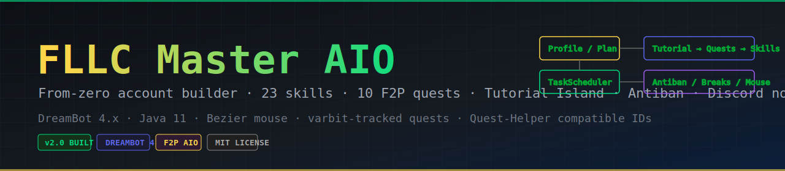
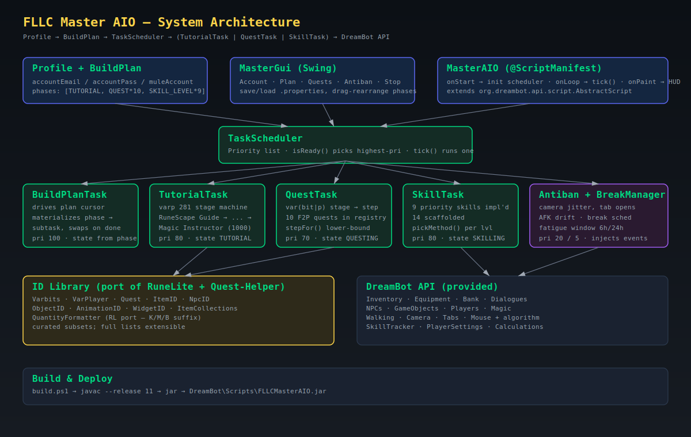
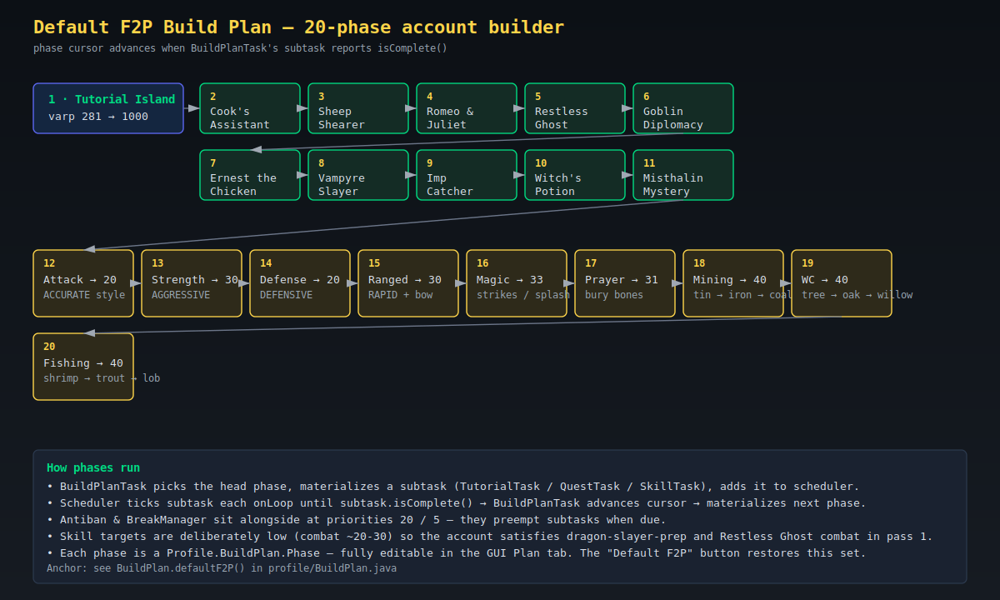
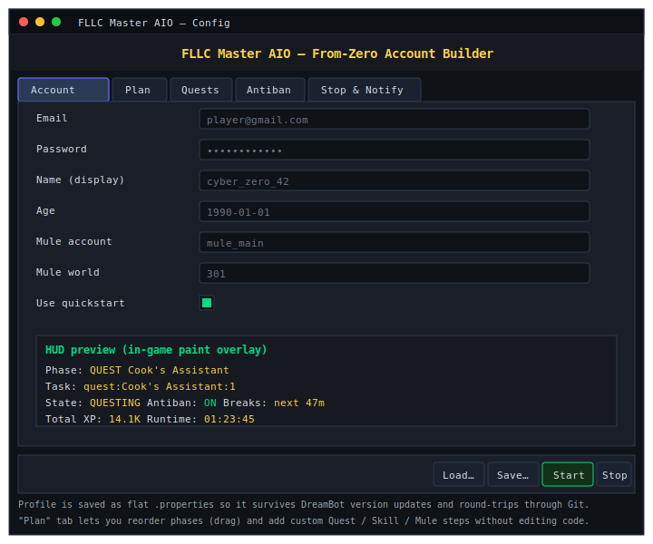
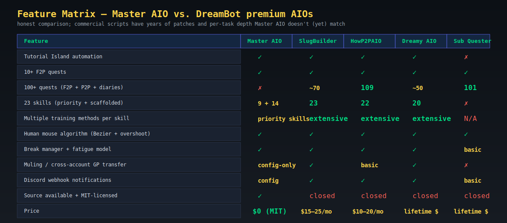

<div align="center">

# FLLC Master AIO

*From-zero account builder for DreamBot — Tutorial Island, 10 F2P quests, 9 priority skills, antiban, breaks.*



[](https://openjdk.org/)
[](https://dreambot.org/)
[](../LICENSE)
[](#)

</div>

---

## What it is

A single DreamBot script that drives a fresh F2P account from the login screen through Tutorial Island, ten F2P quests, and the early-game combat/gathering skill curve — without you touching the keyboard. Architectural goals mirror commercial AIOs like SlugBuilder, HowP2PAIO, Dreamy AIO and Sub Account Builder: a profile-driven build plan, a priority-ordered task scheduler, a humanized mouse, and a Discord-ready event channel.

Source-available, MIT-licensed, no per-script subscription.

> Heads-up: OSRS bot scripts violate Jagex's Terms of Service. Any account that runs this code is at risk of permanent ban. Use disposable accounts.

---

## Architecture



| Layer | Class | Responsibility |
| --- | --- | --- |
| Entry | [`MasterAIO`](src/nezz/dreambot/master/core/MasterAIO.java) | `@ScriptManifest`, lifecycle, paint HUD |
| State | [`BotState`](src/nezz/dreambot/master/core/BotState.java) | top-level lifecycle enum |
| Config | [`Profile`](src/nezz/dreambot/master/profile/Profile.java) | account creds, plan, antiban, mule |
| Plan | [`BuildPlan`](src/nezz/dreambot/master/profile/BuildPlan.java) | ordered `Phase` list, `defaultF2P()` factory |
| Scheduler | [`TaskScheduler`](src/nezz/dreambot/master/tasks/TaskScheduler.java) | priority-ordered task pump |
| Driver | [`BuildPlanTask`](src/nezz/dreambot/master/tasks/BuildPlanTask.java) | walks plan → materializes subtasks |
| Quests | [`Quest`](src/nezz/dreambot/master/quests/Quest.java) / [`QuestTask`](src/nezz/dreambot/master/quests/QuestTask.java) | varbit-driven step machine |
| Skills | [`SkillModule`](src/nezz/dreambot/master/skills/SkillModule.java) / [`SkillTask`](src/nezz/dreambot/master/skills/SkillTask.java) | progressive trainers |
| Antiban | [`HumanMouse`](src/nezz/dreambot/master/antiban/HumanMouse.java) / [`Antiban`](src/nezz/dreambot/master/antiban/Antiban.java) / [`BreakManager`](src/nezz/dreambot/master/antiban/BreakManager.java) | Bezier mouse, events, breaks |
| GUI | [`MasterGui`](src/nezz/dreambot/master/gui/MasterGui.java) | 5-tab Swing config |
| IDs | [`id/*`](src/nezz/dreambot/master/id/) | RuneLite + Quest-Helper ports |

---

## Build plan

The default F2P plan is 20 ordered phases:



Edit phases in the GUI's **Plan** tab, or programmatically via `Profile.plan = BuildPlan.defaultF2P()` and `.add(new Phase(...))`. Each phase becomes a subtask added to the scheduler at the appropriate priority.

---

## Antiban / human mouse


`HumanMouse` installs as a DreamBot `MouseAlgorithm` and replaces straight-line cursor movement with a cubic Bezier curve. Tunables:

- `overshootChance = 0.18` — fraction of moves that pass the target before settling
- `tremor = 1.4 px` — gaussian jitter per segment
- `baseSpeed = 6 ms` / `speedVar = 5 ms` — per-segment dwell time
- `curve = 0.18-0.4 × distance` — perpendicular control-point offset

`Antiban` registers a low-priority task that, ~every 18-45s, randomly rotates the camera, opens a sidebar tab, hovers a skill, or AFKs briefly. `BreakManager` schedules log-outs every 45-90 minutes for 5-20 minutes, and enforces a rolling 6h/24h fatigue cap.

---

## GUI



Five tabs:

1. **Account** — email / pass / display name / age / mule details
2. **Plan** — list current phases, add/remove Quest and Skill phases, reset to F2P default
3. **Quests** — checklist of implemented quests (so you can see what the engine knows)
4. **Antiban** — toggles for mouse / camera / tabs / AFK + break and fatigue intervals
5. **Stop & Notify** — Discord webhook, stop conditions, ban detection toggle

Profile state is saved as a flat `.properties` file via `Profile.save(Path)` — survives DreamBot version changes and round-trips through Git.

---

## What's implemented

### Quests (10)

| # | Quest | Stage source | File |
| - | - | - | - |
| 1 | Cook's Assistant | varbit 29 | [`CooksAssistant.java`](src/nezz/dreambot/master/quests/impl/CooksAssistant.java) |
| 2 | Sheep Shearer | varbit 179 | [`SheepShearer.java`](src/nezz/dreambot/master/quests/impl/SheepShearer.java) |
| 3 | Romeo & Juliet | varp 144 | [`RomeoAndJuliet.java`](src/nezz/dreambot/master/quests/impl/RomeoAndJuliet.java) |
| 4 | Restless Ghost | varp 107 | [`RestlessGhost.java`](src/nezz/dreambot/master/quests/impl/RestlessGhost.java) |
| 5 | Goblin Diplomacy | varp 130 | [`GoblinDiplomacy.java`](src/nezz/dreambot/master/quests/impl/GoblinDiplomacy.java) |
| 6 | Ernest the Chicken | varp 32 | [`ErnestTheChicken.java`](src/nezz/dreambot/master/quests/impl/ErnestTheChicken.java) |
| 7 | Vampyre Slayer | varp 178 | [`VampyreSlayer.java`](src/nezz/dreambot/master/quests/impl/VampyreSlayer.java) |
| 8 | Imp Catcher | varp 160 | [`ImpCatcher.java`](src/nezz/dreambot/master/quests/impl/ImpCatcher.java) |
| 9 | Witch's Potion | varp 67 | [`WitchesPotion.java`](src/nezz/dreambot/master/quests/impl/WitchesPotion.java) |
| 10 | Misthalin Mystery | varbit 6557 | [`MisthalinMystery.java`](src/nezz/dreambot/master/quests/impl/MisthalinMystery.java) |

### Priority skills (9 — multiple methods each)

| Skill | Methods | File |
| - | - | - |
| Attack | chickens → cows → rock crabs → ogresses | [`AttackModule.java`](src/nezz/dreambot/master/skills/impl/AttackModule.java) |
| Strength | same progression, AGGRESSIVE style | [`StrengthModule.java`](src/nezz/dreambot/master/skills/impl/StrengthModule.java) |
| Defense | same progression, DEFENSIVE style | [`DefenseModule.java`](src/nezz/dreambot/master/skills/impl/DefenseModule.java) |
| Ranged | cows → minotaurs → crabs → ammonite crabs | [`RangedModule.java`](src/nezz/dreambot/master/skills/impl/RangedModule.java) |
| Magic | strikes → splash → high alch | [`MagicModule.java`](src/nezz/dreambot/master/skills/impl/MagicModule.java) |
| Prayer | bury / altar / chaos altar | [`PrayerModule.java`](src/nezz/dreambot/master/skills/impl/PrayerModule.java) |
| Mining | tin → iron → coal → MLM | [`MiningModule.java`](src/nezz/dreambot/master/skills/impl/MiningModule.java) |
| Woodcutting | tree → oak → willow → maple → yew → magic | [`WoodcuttingModule.java`](src/nezz/dreambot/master/skills/impl/WoodcuttingModule.java) |
| Fishing | shrimp → trout → lobster → swordfish → shark | [`FishingModule.java`](src/nezz/dreambot/master/skills/impl/FishingModule.java) |

### Scaffolded skills (14)

Registered, addressable from a build plan, but tick body is a noop pending detailed implementation: Agility, Cooking, Construction, Crafting, Farming, Firemaking, Fletching, Herblore, Hunter, Runecrafting, Slayer, Smithing, Thieving, Sailing. See [`ScaffoldedSkills.java`](src/nezz/dreambot/master/skills/impl/ScaffoldedSkills.java).

### ID library (port of RuneLite + Quest-Helper)

- [`Varbits`](src/nezz/dreambot/master/id/Varbits.java) — account / quest / GE / diary IDs
- [`VarPlayer`](src/nezz/dreambot/master/id/VarPlayer.java) — config IDs
- [`Quest`](src/nezz/dreambot/master/id/Quest.java) — quest completion varps + member flag
- [`ItemID`](src/nezz/dreambot/master/id/ItemID.java) — F2P starter items, runes, food
- [`NpcID`](src/nezz/dreambot/master/id/NpcID.java) — quest givers, training mobs
- [`ObjectID`](src/nezz/dreambot/master/id/ObjectID.java) — banks, rocks, trees, doors
- [`AnimationID`](src/nezz/dreambot/master/id/AnimationID.java) — gathering / combat / cast anims
- [`WidgetID`](src/nezz/dreambot/master/id/WidgetID.java) — UI group IDs
- [`ItemCollections`](src/nezz/dreambot/master/id/ItemCollections.java) — named groups (any axe / any pickaxe / F2P food)
- [`QuantityFormatter`](src/nezz/dreambot/master/util/QuantityFormatter.java) — verbatim port of RuneLite's client util

---

## Honest comparison



Master AIO is alpha-quality and free; commercial AIOs have years of patches, exhaustive per-task depth, and active maintenance. Use Master AIO if you want:

- a starting point you can read and edit
- F2P 1-account-from-zero coverage
- a clean task scheduler / ID library you can extend with your own skills and quests

Use a commercial AIO if you want:

- production-stable 23-skill depth (Slug, Dreamy)
- 100+ quest coverage (HowP2PAIO, Sub Quester)
- a fully integrated mule + bond flow
- vendor responsibility for game-update breakage

---

## Build & deploy

```powershell
cd CyberBot\DreambotMasterAIO
powershell -File .\build.ps1
```

The script:

1. compiles all `src/**/*.java` against `dreambot-client.jar` with `--release 11`
2. packages `out/FLLCMasterAIO.jar`
3. copies it to `%USERPROFILE%\DreamBot\Scripts\FLLCMasterAIO.jar`

Refresh the DreamBot scripts list and pick **"FLLC Master AIO"**. The Swing config window opens automatically.

Override paths in `build.ps1` if your JDK / DreamBot install lives elsewhere.

---

## Extending

### Add a quest

1. Subclass [`Quest`](src/nezz/dreambot/master/quests/Quest.java) in `quests/impl/`. Populate the `steps` map keyed by stage value.
2. Register the new quest in [`QuestRegistry`](src/nezz/dreambot/master/quests/QuestRegistry.java).
3. Reference it from a `Profile.plan` phase: `new BuildPlan.Phase(PhaseType.QUEST, "Quest Name", 0)`.

### Add a skill method

1. Add a method name to your `SkillModule.methods()` array.
2. Handle it in `pickMethod()` (level gates) and `tick()` (one-tick behaviour).
3. Targets are configured by `Profile` so you don't need to recompile to change `currentLevel < X → method` thresholds (yet — that knob will land in a later patch).

### Add a new ID constant

The ID library is intentionally a *curated subset*. To extend, append the constant to the appropriate file under `id/` with the same name as the RuneLite / Quest-Helper canonical, so a future automated porter can extend without rename churn.

---

## Roadmap

- [ ] Fill scaffolded skills (Agility courses, Cooking ranges, Smithing progression, RC altars)
- [ ] Quest pack 2 — 10 more F2P (Dragon Slayer, Prince Ali Rescue, Doric, Demon Slayer, Pirate's Treasure, X Marks the Spot, Knight's Sword, Shield of Arrav, Rune Mysteries, Below Ice Mountain)
- [ ] Discord webhook implementation
- [ ] Bond / mule auto-trade flow
- [ ] GE restock task for consumable skills (Herblore, Fletching)
- [ ] Real ban detection (login-screen pattern matching)
- [ ] Per-account screenshot diaries

---

## Credits

- DreamBot devs — API & client
- RuneLite & open-osrs — public API constants
- Zoinkwiz Quest-Helper — quest varbit / step model reference
- DreamBot script authors (SlugBuilder, HowP2PAIO, Sub Builder, Dreamy AIO, Guester, Hans Crafting, Pfft's Miner, Pandemic, Bento) — architectural inspiration

Code in this module is original; no commercial script source has been copied.
