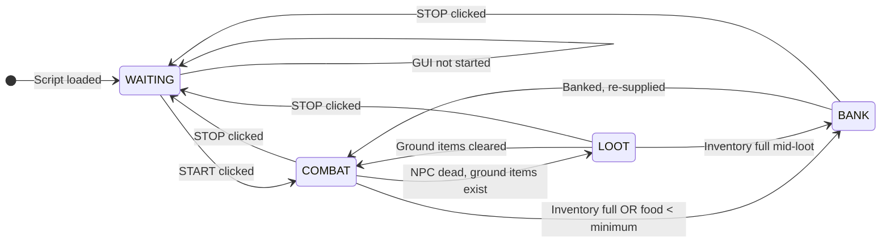
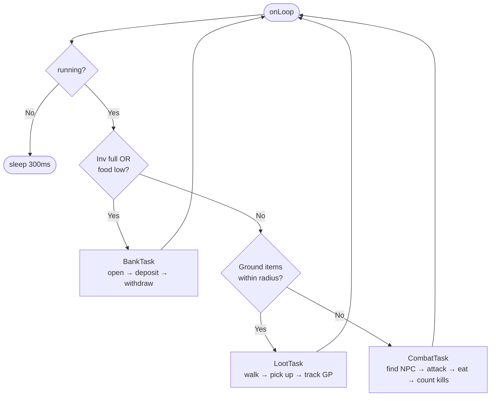
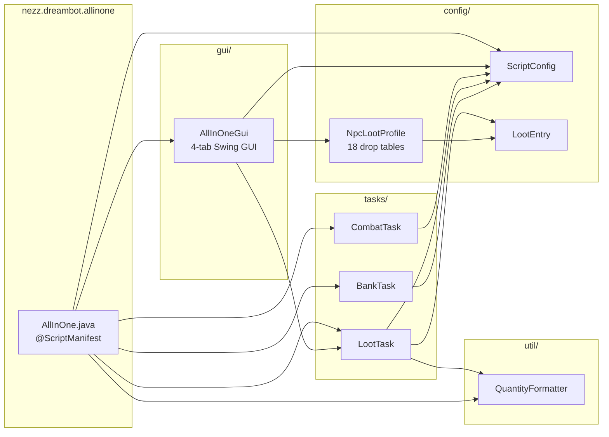
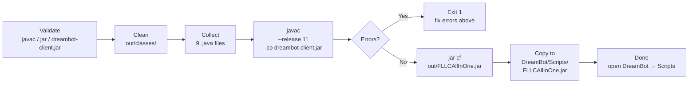
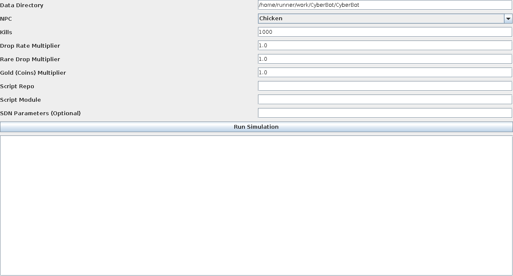
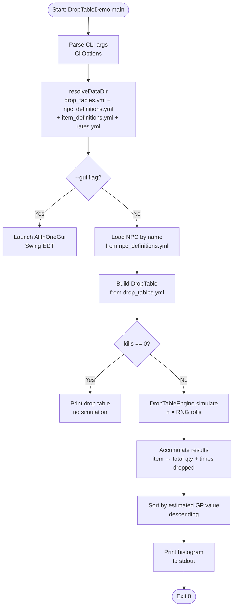

<div align="center">

```
  ██████╗██╗   ██╗██████╗ ███████╗██████╗ ██████╗  ██████╗ ████████╗
 ██╔════╝╚██╗ ██╔╝██╔══██╗██╔════╝██╔══██╗██╔══██╗██╔═══██╗╚══██╔══╝
 ██║      ╚████╔╝ ██████╔╝█████╗  ██████╔╝██████╔╝██║   ██║   ██║   
 ██║       ╚██╔╝  ██╔══██╗██╔══╝  ██╔══██╗██╔══██╗██║   ██║   ██║   
 ╚██████╗   ██║   ██████╔╝███████╗██║  ██║██████╔╝╚██████╔╝   ██║   
  ╚═════╝   ╚═╝   ╚═════╝ ╚══════╝╚═╝  ╚═╝╚═════╝  ╚═════╝   ╚═╝   
```

*Injecting digital supremacy into the ancient rune-world since 2025.*

[](https://openjdk.org/)
[](https://dreambot.org/)
[](https://oldschool.runescape.com/)
[](LICENSE)
[](https://github.com/Personfu/CyberBot)
[](DreambotAllInOne/build.ps1)


</div>

---

> **Java — an outdated language?** Maybe. But did we absolutely *smoke* it with this project?  
> **Undeniably.** Welcome to CyberBot — where 1990s bytecode meets 2025 cyber operations.

> **New in v2.x:** [`DreambotMasterAIO`](DreambotMasterAIO/) — a from-zero account builder that drives a fresh F2P account through Tutorial Island, ten F2P quests, and the first 30-40 levels of the priority skills (Attack, Strength, Defense, Ranged, Magic, Prayer, Mining, Woodcutting, Fishing). Architecture cribbed from commercial AIOs (Slug, HowP2P, Dreamy, Sub Builder, Guester); source open and MIT.

---

## Table of Contents

- [What Is CyberBot?](#what-is-cyberbot)
- [Project Layout](#project-layout)
- [FLLC Master AIO (new)](#fllc-master-aio-new)
  - [Master AIO Architecture](#master-aio-architecture)
  - [Build Plan](#build-plan)
  - [Antiban + Human Mouse](#antiban--human-mouse)
  - [GUI Mockup](#gui-mockup)
  - [Feature Matrix vs. Commercial AIOs](#feature-matrix-vs-commercial-aios)
- [FLLC All-In-One Script](#fllc-all-in-one-script)
  - [Features at a Glance](#features-at-a-glance)
  - [Script State Machine](#script-state-machine)
  - [Task Pipeline](#task-pipeline)
  - [Package Architecture](#package-architecture)
  - [The 4-Tab GUI](#the-4-tab-gui)
  - [Supported NPCs (18 Total)](#supported-npcs-18-total)
  - [LootEntry Configuration API](#lootentry-configuration-api)
  - [ScriptConfig Reference](#scriptconfig-reference)
  - [Build & Deploy](#build--deploy)
- [Drop Table Simulator](#drop-table-simulator)
  - [Overview](#overview)
  - [Simulator GUI](#simulator-gui)
  - [CLI Flags Reference](#cli-flags-reference)
  - [Simulator Flow](#simulator-flow)
  - [Example Runs](#example-runs)
- [Maven Build (pom.xml)](#maven-build-pomxml)
- [Prerequisites](#prerequisites)
- [Contributing](#contributing)

---

## What Is CyberBot?

CyberBot is a **dual-module OSRS automation suite** built for [DreamBot](https://dreambot.org/):

| Module | Purpose |
|--------|---------|
| **`DreambotAllInOne`** | Full DreamBot script — combat, looting, banking, 4-tab Swing GUI, 18 NPC drop tables, rates simulator, SDN setup fields. Compiled to `FLLCAllInOne.jar` and dropped directly into DreamBot's Scripts folder. |
| **Drop Table Simulator** | Standalone Java CLI + GUI tool. Simulates `n` kills against any configured NPC with tunable multipliers. Driven by YAML config files — no recompile needed to add NPCs or items. |

Both modules share the same **CyberWorld philosophy**: data-driven, configurable to the extreme, and built to squeeze every drop of performance out of Java's ancient runtime.

The v2.0 expansion adds a third pillar:

| Module | Purpose |
| --- | --- |
| **`DreambotMasterAIO`** | From-zero F2P account builder. Tutorial Island, 10 implemented F2P quests, 9 priority skill modules (with progressive method selection), 14 scaffolded skills, antiban with Bezier mouse + break manager + fatigue model, 5-tab Swing GUI, JSON-free profile persistence. See [`DreambotMasterAIO/README.md`](DreambotMasterAIO/README.md). |

---

## FLLC Master AIO (new)

> ⚠️ OSRS botting violates Jagex's Terms of Service. Use disposable accounts. This module is research / educational code.

A single DreamBot script that drives a fresh account from the login screen through the early F2P curve without you touching the keyboard. Modelled after — but not copied from — commercial DreamBot AIOs: SlugBuilder, HowP2PAIO, Dreamy AIO Skiller Elite, Sub Account Builder, Guester, Hans Crafting, Pfft's Miner.

### Master AIO Architecture


| Layer | File | Responsibility |
| --- | --- | --- |
| Entry | [`MasterAIO.java`](DreambotMasterAIO/src/nezz/dreambot/master/core/MasterAIO.java) | `@ScriptManifest`, lifecycle, paint HUD |
| Plan | [`BuildPlan.java`](DreambotMasterAIO/src/nezz/dreambot/master/profile/BuildPlan.java) | ordered phases, `defaultF2P()` factory |
| Scheduler | [`TaskScheduler.java`](DreambotMasterAIO/src/nezz/dreambot/master/tasks/TaskScheduler.java) | priority-ordered task pump |
| Driver | [`BuildPlanTask.java`](DreambotMasterAIO/src/nezz/dreambot/master/tasks/BuildPlanTask.java) | walks plan → materializes subtasks |
| Tutorial | [`TutorialTask.java`](DreambotMasterAIO/src/nezz/dreambot/master/tasks/TutorialTask.java) | varp-281 state machine, all 12 sections |
| Quests | [`QuestTask.java`](DreambotMasterAIO/src/nezz/dreambot/master/quests/QuestTask.java) + [`impl/`](DreambotMasterAIO/src/nezz/dreambot/master/quests/impl) | varbit-driven step machine |
| Skills | [`SkillTask.java`](DreambotMasterAIO/src/nezz/dreambot/master/skills/SkillTask.java) + [`impl/`](DreambotMasterAIO/src/nezz/dreambot/master/skills/impl) | progressive trainers |
| Antiban | [`HumanMouse.java`](DreambotMasterAIO/src/nezz/dreambot/master/antiban/HumanMouse.java), [`Antiban.java`](DreambotMasterAIO/src/nezz/dreambot/master/antiban/Antiban.java), [`BreakManager.java`](DreambotMasterAIO/src/nezz/dreambot/master/antiban/BreakManager.java) | mouse, events, breaks |
| GUI | [`MasterGui.java`](DreambotMasterAIO/src/nezz/dreambot/master/gui/MasterGui.java) | 5-tab Swing config |
| IDs | [`id/`](DreambotMasterAIO/src/nezz/dreambot/master/id) | RuneLite + Quest-Helper ports |

### Build Plan

The default plan walks 20 phases:


Phase order matches the requirements: **Tutorial Island → Cook's Assistant → Sheep Shearer → Romeo & Juliet → Restless Ghost → Goblin Diplomacy → Ernest the Chicken → Vampyre Slayer → Imp Catcher → Witch's Potion → Misthalin Mystery → Attack 20 → Strength 30 → Defense 20 → Ranged 30 → Magic 33 → Prayer 31 → Mining 40 → Woodcutting 40 → Fishing 40.**

### Antiban + Human Mouse


`HumanMouse` installs as a DreamBot `MouseAlgorithm` and replaces linear motion with a cubic Bezier curve plus per-segment Gaussian tremor and an 18% chance of overshoot. `Antiban` fires camera / tab / AFK events every 18–45s; `BreakManager` schedules log-outs every 45–90 min for 5–20 min with a rolling 6h/24h fatigue cap.

### GUI Mockup


Five tabs: **Account · Plan · Quests · Antiban · Stop & Notify.** Profile state persists as flat `.properties`, so it survives DreamBot version updates and round-trips through Git.

### Feature Matrix vs. Commercial AIOs


Honest take: Master AIO is alpha, F2P-focused, and free; the commercial AIOs are production-stable and exhaustive. We're not trying to one-shot them — we're providing a readable, extensible source-available scaffold that you can patch yourself without waiting on a vendor.

---

## Project Layout

```
CyberBot/
│
├── DreambotMasterAIO/              ◄ NEW · From-zero F2P account builder
│   ├── build.ps1                   ◄ Compile + deploy to DreamBot Scripts
│   ├── README.md                   ◄ Module-level docs (deep-dive)
│   └── src/nezz/dreambot/master/
│       ├── core/                   ◄ MasterAIO, BotState, Logger
│       ├── profile/                ◄ Profile, BuildPlan
│       ├── tasks/                  ◄ Task, TaskScheduler, BuildPlanTask, TutorialTask
│       ├── quests/                 ◄ Quest, QuestStep, QuestRegistry, QuestTask, impl/×10
│       ├── skills/                 ◄ SkillModule, SkillRegistry, SkillTask, impl/×9 + scaffold
│       ├── antiban/                ◄ HumanMouse, Antiban, BreakManager
│       ├── gui/                    ◄ MasterGui (Swing)
│       ├── id/                     ◄ Varbits, VarPlayer, Quest, ItemID, NpcID,
│       │                              ObjectID, AnimationID, WidgetID, ItemCollections
│       └── util/                   ◄ QuantityFormatter (RuneLite port)
│
├── DreambotAllInOne/               ◄ The DreamBot script module
│   ├── build.ps1                   ◄ One-command compile + deploy (PowerShell)
│   └── src/nezz/dreambot/allinone/
│       ├── AllInOne.java           ◄ @ScriptManifest entry point + state machine
│       ├── config/
│       │   ├── LootEntry.java      ◄ Per-item drop config (rate, qty, filters)
│       │   ├── NpcLootProfile.java ◄ Hardcoded OSRS drop tables — 18 NPCs
│       │   └── ScriptConfig.java   ◄ All runtime settings (NPC, food, bank, etc.)
│       ├── gui/
│       │   └── AllInOneGui.java    ◄ Dark-theme 4-tab Swing GUI
│       ├── tasks/
│       │   ├── CombatTask.java     ◄ Attack, eat, kill-track
│       │   ├── LootTask.java       ◄ Ground item pickup + GP accounting
│       │   └── BankTask.java       ◄ Deposit all except food, withdraw supplies
│       └── util/
│           └── QuantityFormatter.java  ◄ "1500000" → "1.5m"
│
├── assets/
│   ├── drop-table-gui.png          ◄ legacy: drop-sim GUI screenshot
│   └── master/                     ◄ NEW: SVG diagrams for the Master AIO module
│       ├── banner.svg
│       ├── architecture.svg
│       ├── build-plan-flow.svg
│       ├── antiban-curve.svg
│       ├── gui-mockup.svg
│       └── feature-matrix.svg
│
├── DropEntry.java                  ◄ Simulator: one drop-table row
├── DropTable.java                  ◄ Simulator: weighted table of entries
├── DropTableEngine.java            ◄ Simulator: RNG roller + multiplier engine
├── DropTableDemo.java              ◄ Simulator: CLI entrypoint + GUI launcher
├── Item.java                       ◄ Simulator: item definition (id, name, value)
├── Npc.java                        ◄ Simulator: NPC definition with drop table ref
├── QuantityRange.java              ◄ Simulator: [min, max] roll helper
├── Rates.java                      ◄ Simulator: multiplier config POJO
│
├── drop_tables.yml                 ◄ YAML: NPC drop tables for simulator
├── npc_definitions.yml             ◄ YAML: NPC metadata
├── item_definitions.yml            ◄ YAML: item metadata + GE values
├── rates.yml                       ◄ YAML: default multiplier config
└── pom.xml                         ◄ Maven build (produces executable JAR)
```

---

## FLLC All-In-One Script

### Features at a Glance

| Category | Feature |
|----------|---------|
| **Combat** | Auto-attack configurable NPC by name + ID; melee/ranged/magic style selection; automatic food eating at HP% threshold |
| **Loot** | Per-item pickup filters (enabled toggle, min quantity, min GE value); ~50-item hardcoded price map; running GP total |
| **Banking** | Auto-bank when inventory full or food drops below minimum; configurable bank distance; deposit-all-except-food |
| **GUI** | Full dark-theme Swing GUI; 4 tabs; START/STOP button; live state display |
| **NPCs** | 18 pre-configured OSRS NPCs with real item IDs and OSRS Wiki drop rates |
| **Simulator** | In-GUI rates simulator: run N kills, apply multipliers, see histogram sorted by GP value |
| **Paint** | On-screen overlay: GP looted, kill count, runtime, GP/hr |
| **SDN** | Pre-filled repo URL and module name with copy buttons and link to SDN submission page |

---

### Script State Machine

The script runs a tight four-state loop driven by `AllInOne.onLoop()`:



---

### Task Pipeline

Each loop iteration, `nextState()` evaluates tasks in **priority order**:



---

### Package Architecture



---

### The 4-Tab GUI

The GUI opens automatically when the script starts in DreamBot. It uses a dark OSRS gold-accent colour palette (`#1e1e1e` background, `#ffc81e` gold accents).

#### Tab 1 — ⚔ Combat

| Control | Type | Description |
|---------|------|-------------|
| **NPC** | Combo | Select from 18 presets — auto-fills NPC ID and loads that NPC's drop table |
| **NPC ID** | Text field | Override or enter a custom NPC ID |
| **Attack Style** | Radio | Melee / Ranged / Magic |
| **Food** | Combo | Shark, Lobster, Swordfish, Monkfish, Tuna, Manta Ray |
| **Eat at HP%** | Spinner | Eat food when HP falls below this percentage (default 50%) |
| **Min Food** | Spinner | Minimum food stacks before banking to re-supply |
| **Bank When Full** | Checkbox | Auto-bank when inventory is full |
| **Bank Distance** | Spinner | Max tiles to nearest bank before banking is triggered |
| **Loot Radius** | Spinner | Maximum tiles from kill spot to pick up ground items |

#### Tab 2 — 🎒 Loot Config

Live-editable table with one row per item in the selected NPC's drop table.

| Column | Editable | Description |
|--------|----------|-------------|
| ✓ | Yes | Enable/disable pickup for this item |
| Item | No | Item name from OSRS drop data |
| Drop Rate | No | Formatted rate e.g. `1/512`, `Always`, `~1/8` |
| Qty Range | No | Min–max quantity rolled per drop |
| Min Pick Qty | Yes | Only pick up if quantity ≥ this value |
| Min GP Value | Yes | Only pick up if approximate GE value ≥ this (0 = no filter) |

**Bulk action buttons:**
- `Check All` — enable all items
- `Uncheck All` — disable all items  
- `Valuables Only (≥50k)` — enable only items worth ≥ 50,000 GP

#### Tab 3 — 📊 Rates Simulator

Run a Monte Carlo drop simulation entirely within the GUI using a background `SwingWorker` thread so the UI stays responsive.

| Control | Description |
|---------|-------------|
| **NPC** | Simulate drops for any of the 18 NPCs |
| **Kills** | Number of kills to simulate (1 – 10,000,000) |
| **Drop Rate Multiplier** | Scale all drop rates (e.g. `2.0` = 2× more frequent drops) |
| **Rare Multiplier** | Extra boost to rare items only (rates with denominator ≥ 64) |

Output is a **histogram sorted by descending GP value** showing item name, times dropped, quantity dropped, approximate total GP, and drop rate as rolled.

#### Tab 4 — 🔗 SDN Setup

Pre-filled SDN submission fields for when you're ready to publish:

| Field | Value |
|-------|-------|
| **Script Repo** | `https://github.com/Personfu/CyberBot/` |
| **Script Module** | `nezz.dreambot.allinone.AllInOne` |

Both fields have one-click **Copy** buttons. A button opens the SDN submission page directly in your browser.

> **Note:** The DreamBot SDN enforces a 20-character module name limit. `nezz.dreambot.allinone.AllInOne` is 34 characters — this script is **local-only** loaded from the Scripts folder. The SDN tab is there for future reference and shorter module names.

---

### Supported NPCs (18 Total)

Drop tables sourced from [OSRS Wiki](https://oldschool.runescape.wiki/) with real item IDs.  
All rates marked `~` are approximated from weighted tables.

| NPC | Combat Lvl | Notable Drops | Rarest Drop |
|-----|:---------:|---------------|-------------|
| [**Chicken**](https://oldschool.runescape.wiki/w/Chicken) | 1 | Bones, Raw chicken, Feathers | — |
| [**Cow**](https://oldschool.runescape.wiki/w/Cow) | 2 | Cowhide, Raw beef | — |
| [**Goblin**](https://oldschool.runescape.wiki/w/Goblin) | 2 | Bones, Coins | Gold bar `1/128` |
| [**Hill Giant**](https://oldschool.runescape.wiki/w/Hill_Giant) | 28 | Big bones, Limpwurt root | Giant key `1/128` |
| [**Moss Giant**](https://oldschool.runescape.wiki/w/Moss_giant) | 42 | Big bones, Mossy key | Rune med helm `1/128` |
| [**Lesser Demon**](https://oldschool.runescape.wiki/w/Lesser_demon) | 82 | Ashes, Rune med helm | Rune full helm `1/128` |
| [**Greater Demon**](https://oldschool.runescape.wiki/w/Greater_demon) | 92 | Ashes, Rune chainbody | Rune sq shield `1/128` |
| [**Black Demon**](https://oldschool.runescape.wiki/w/Black_demon) | 172 | Ashes, Rune battleaxe | Rune 2h sword `1/128` |
| [**Abyssal Demon**](https://oldschool.runescape.wiki/w/Abyssal_demon) | 124 | Ashes, Ensouled head | **Abyssal whip** `1/512` |
| [**Gargoyle**](https://oldschool.runescape.wiki/w/Gargoyle) | 111 | Granite maul, Gold bar | **Granite maul** `1/256` |
| [**Dagannoth Rex**](https://oldschool.runescape.wiki/w/Dagannoth_Rex) | 303 | Dagannoth bones | **Berserker ring** `1/128` |
| [**Dagannoth Supreme**](https://oldschool.runescape.wiki/w/Dagannoth_Supreme) | 303 | Dagannoth bones | **Archers' ring** `1/128` |
| [**Dagannoth Prime**](https://oldschool.runescape.wiki/w/Dagannoth_Prime) | 303 | Dagannoth bones | **Seers' ring** `1/128` |
| [**General Graardor**](https://oldschool.runescape.wiki/w/General_Graardor) | 624 | Ourg bones, Rune items | **Bandos chestplate** `1/384` |
| [**Cerberus**](https://oldschool.runescape.wiki/w/Cerberus) | 318 | Ashes, Smouldering stone | **Primordial crystal** `1/512` |
| [**King Black Dragon**](https://oldschool.runescape.wiki/w/King_Black_Dragon) | 276 | Dragon bones, Black dragonhide | **KBD heads** `1/128` |
| [**Vorkath**](https://oldschool.runescape.wiki/w/Vorkath) | 732 | Dagannoth bones, Dragonhide | **Draconic visage** `1/5000` |
| [**Zulrah**](https://oldschool.runescape.wiki/w/Zulrah) | 725 | Zulrah's scales | **Tanzanite fang** `1/512` |

---

### LootEntry Configuration API

`LootEntry` is the core data class for every item in a drop table. Factory methods cover all OSRS drop table patterns:

```java
// ── Always drops (bones, ashes, hides) ────────────────────────────────────
LootEntry.always("Big bones", 532, 1)

// ── Always drops with quantity range (feathers, coins, etc.) ─────────────
LootEntry.alwaysRange("Feathers", 314, 5, 15)

// ── Weight-based table (most common drop table format on OSRS Wiki) ───────
// weight = this item's weight, weightedTotal = sum of all weights in table
LootEntry.weighted("Rune chainbody", 3140, 1, 1, 4, 128)

// ── Fixed fractional rate  e.g. 1/512 ────────────────────────────────────
LootEntry.rate("Abyssal whip", 4151, 1, 512)

// ── Fixed fractional rate with quantity range ─────────────────────────────
LootEntry.rateRange("Zulrah's scales", 12934, 100, 300, 1)
```

**Runtime-configurable fields** (editable in the Loot Config tab or programmatically):

| Field | Type | Default | Description |
|-------|------|---------|-------------|
| `enabled` | `boolean` | `true` | Whether the script picks up this item |
| `minPickupQty` | `int` | `1` | Skip pickup if ground item qty < this |
| `minPickupGeValue` | `long` | `0` | Skip pickup if estimated GE value < this (0 = no filter) |

---

### ScriptConfig Reference

All runtime settings live in `ScriptConfig`. Key fields:

| Field | Type | Default | Description |
|-------|------|---------|-------------|
| `targetNpcName` | `String` | `"Chicken"` | NPC name to attack |
| `targetNpcId` | `int` | `3169` | NPC ID to match |
| `attackStyle` | `String` | `"Melee"` | Combat style |
| `foodName` | `String` | `"Shark"` | Food item name |
| `eatAtHpPercent` | `int` | `50` | Eat when HP% drops to this |
| `minFoodCount` | `int` | `5` | Bank if food drops below this |
| `bankWhenFull` | `boolean` | `true` | Bank on full inventory |
| `bankDistance` | `int` | `50` | Max tiles to nearest bank |
| `lootRadius` | `int` | `5` | Tiles from kill spot to pick up loot |
| `lootEntries` | `List<LootEntry>` | NPC preset | Per-item pickup config |
| `sdnScriptRepo` | `String` | CyberBot URL | SDN submission field |
| `sdnScriptModule` | `String` | AllInOne FQCN | SDN submission field |

---

### Build & Deploy

#### Prerequisites

| Tool | Path | Notes |
|------|------|-------|
| JDK 26 | `%USERPROFILE%\Downloads\jdk-26.0.1\bin\` | Compiles to `--release 11` |
| DreamBot client JAR | `%USERPROFILE%\DreamBot\BotData\repository2\dreambot-client.jar` | API classpath |
| DreamBot Scripts folder | `%USERPROFILE%\DreamBot\Scripts\` | JAR deployment target |

#### One-Command Build

```powershell
powershell -ExecutionPolicy Bypass -File "C:\Users\pfuru\CyberBot\DreambotAllInOne\build.ps1"
```

**What `build.ps1` does:**



#### Load in DreamBot

1. Open DreamBot client
2. Click **Scripts** → your script list auto-refreshes from the `Scripts/` folder
3. Select **FLLC All-In-One** (category: Combat, author: Personfu)
4. Configure via the GUI and click **START**

> The JAR is ~40 KB. No external dependencies — everything compiles against `dreambot-client.jar` alone.

---

## Drop Table Simulator

### Overview

The standalone simulator lets you **test drop table configurations** without running the actual DreamBot script. It reads three YAML files and runs a Monte Carlo simulation for any NPC:

```
drop_tables.yml       ← which items drop at what rate
item_definitions.yml  ← item names + approximate GE values
npc_definitions.yml   ← NPC names, IDs, level, drop table reference
rates.yml             ← default multiplier config (can be overridden via CLI)
```

### Simulator GUI

Launch with `--gui` to open the Swing interface — configure any NPC, tweak multipliers, and run simulations without touching the command line.



### CLI Flags Reference

```
Usage: DropTableDemo [options] <NpcName> [kills]
```

| Flag | Type | Default | Description |
|------|------|---------|-------------|
| `--data-dir=<path>` | `String` | CWD | Directory containing the four YAML files |
| `--rare-drop-multiplier=<n>` | `double` | `1.0` | Multiply rate of rare drops (1/64 or rarer) |
| `--drop-rate-multiplier=<n>` | `double` | `1.0` | Multiply all drop rates |
| `--gp-multiplier=<n>` | `double` | `1.0` | Multiply quantity of coin drops |
| `--gui` | flag | off | Open the Swing GUI instead of running CLI simulation |

### Simulator Flow



### Example Runs

**Simulate 10,000 Vorkath kills with default rates:**
```bat
java -cp out\classes;lib\snakeyaml-2.2.jar com.cyberscape.rsps317.DropTableDemo ^
  --data-dir=C:\Users\pfuru\CyberBot Vorkath 10000
```

**2× rare drop multiplier (farming that Draconic visage):**
```bat
java -cp out\classes;lib\snakeyaml-2.2.jar com.cyberscape.rsps317.DropTableDemo ^
  --data-dir=C:\Users\pfuru\CyberBot ^
  --rare-drop-multiplier=2 ^
  Vorkath 50000
```

**Coin-drop stress test (100× GP, see if your GP counter overflows):**
```bat
java -cp out\classes;lib\snakeyaml-2.2.jar com.cyberscape.rsps317.DropTableDemo ^
  --data-dir=C:\Users\pfuru\CyberBot ^
  --gp-multiplier=100 ^
  Zulrah 1000
```

**Open the Swing GUI:**
```bat
java -cp out\classes;lib\snakeyaml-2.2.jar com.cyberscape.rsps317.DropTableDemo ^
  --gui --data-dir=C:\Users\pfuru\CyberBot
```

**Compile from source (Windows CMD, JDK 26):**
```bat
cd C:\Users\pfuru\Downloads\jdk-26.0.1\bin
javac -cp C:\Users\pfuru\lib\snakeyaml-2.2.jar ^
      -d C:\Users\pfuru\CyberBot\out\classes ^
      C:\Users\pfuru\CyberBot\DropEntry.java ^
      C:\Users\pfuru\CyberBot\DropTable.java ^
      C:\Users\pfuru\CyberBot\DropTableEngine.java ^
      C:\Users\pfuru\CyberBot\DropTableDemo.java ^
      C:\Users\pfuru\CyberBot\Item.java ^
      C:\Users\pfuru\CyberBot\Npc.java ^
      C:\Users\pfuru\CyberBot\QuantityRange.java ^
      C:\Users\pfuru\CyberBot\Rates.java
```

> **Overflow note:** `--gp-multiplier` values above ~10,000,000× can cause `int` overflow for high-quantity coin drops. Use sane values for accurate simulation.

---

## Maven Build (pom.xml)

The `pom.xml` in the repo root enables IDE-integrated builds and packaging via Maven:

```bash
# Build and package (skipping tests)
mvn -q -DskipTests package

# Run directly via Maven exec plugin (if configured)
mvn exec:java -Dexec.args="Vorkath 10000"

# System-property overrides for multipliers
mvn exec:java -Dexec.args="Vorkath 10000" \
  -Drare_drop_multiplier=10 \
  -Ddrop_rate_multiplier=2 \
  -Dgp_multiplier=5
```

---

## Prerequisites

| Requirement | Version | Where |
|------------|---------|-------|
| JDK | 11+ (26 recommended) | [Adoptium](https://adoptium.net/) / [Oracle](https://jdk.java.net/) |
| DreamBot Client | 4.1.63+ | [dreambot.org](https://dreambot.org/) |
| SnakeYAML | 2.2 | [Maven Central](https://mvnrepository.com/artifact/org.yaml/snakeyaml/2.2) |
| Maven | 3.8+ | [maven.apache.org](https://maven.apache.org/) (optional, for Maven builds only) |
| PowerShell | 5.1+ | Built into Windows 10/11 |

---

## Contributing

```
1. Fork → https://github.com/Personfu/CyberBot/fork
2. Create a feature branch: git checkout -b feature/my-cyber-upgrade
3. Implement your changes (no placeholders — CyberBot ships complete code)
4. Verify the DreamBot script still compiles:
       powershell -ExecutionPolicy Bypass -File DreambotAllInOne\build.ps1
5. Open a PR against master with a clear description
```

**Adding a new NPC drop table:**

1. Add a new `case` in `NpcLootProfile.getDropTable()` with the NPC's name (lowercase)
2. Implement the private static `List<LootEntry> myNpc()` method using factory methods
3. Add the display name to `NpcLootProfile.KNOWN_NPCS[]`
4. Rebuild with `build.ps1`

**Drop rate accuracy:**  
All rates are sourced from [OSRS Wiki](https://oldschool.runescape.wiki/). Weight-based tables use `Math.round((float) weightedTotal / weight)` as the denominator approximation. PRs with improved rates (especially from in-game data mining) are welcome.

---

<div align="center">

```
  ╔══════════════════════════════════════════════════════════╗
  ║  Built in the CyberWorld.  Deployed on ancient bytecode. ║
  ║  Java may be old — but our drops are eternal.            ║
  ╚══════════════════════════════════════════════════════════╝
```

[](https://github.com/Personfu/CyberBot)
[](https://sdn.dreambot.org/)
[](https://oldschool.runescape.wiki/)

</div>
